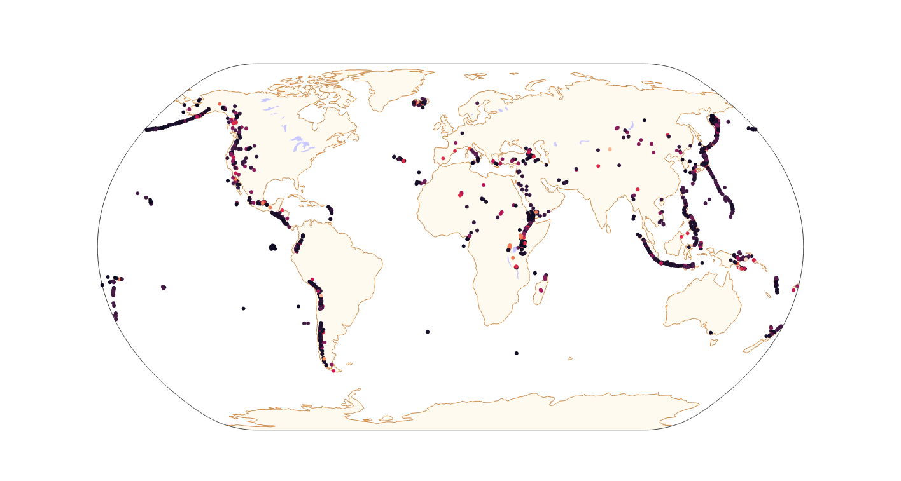

# Volcanoes of the Earth
### Study geographic features comparing volcano types interactively

Plotting with pyplot and plotly

Interactive plot hosted <a href="[http://example.com/](https://scopalaffairs-streamlit-project-volcanoes-of-the-earth-vfvfkf.streamlit.app)" target="_blank">via streamlit app</a>
